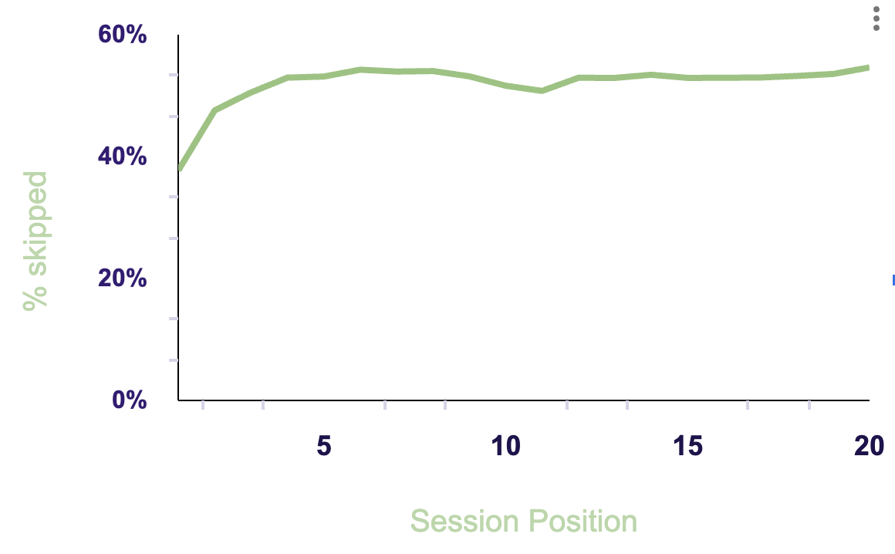
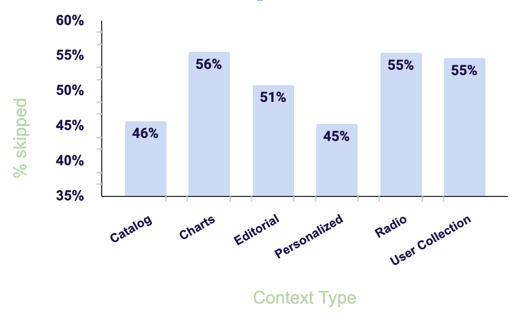
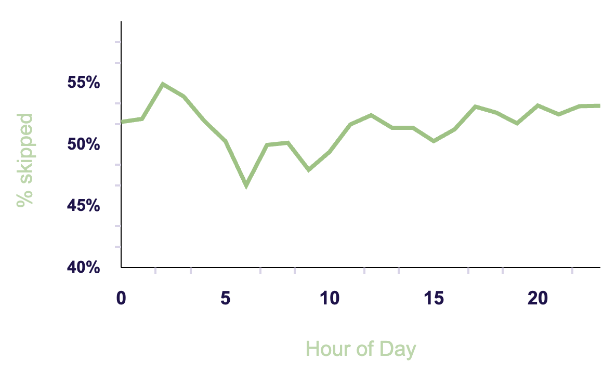

 
 

# Spotify Sequential Skip Prediction Challenge

This project is a hypothetical presentation for Spotify exectives. This is an end-to-end walk through of my data exploration, analysis, and model building (pre-deployment) to analyze and predict a user skipping a track on Spotify, which I will cover in more detail below. 

Source: [AI Crowd: Spotify Sequential Skip Prediction Challenge](https://www.aicrowd.com/challenges/spotify-sequential-skip-prediction-challenge)

Author: Rachael McCue

***************

## Navigating this repository

| Folder | Description |
| --- | --- |
| data | data files |
|  | track_features  tf_mini.csv : mini version of original dataset, contains track IDs and features |
|  | training_set  log_mini.csv : mini version of original dataset, contains unique session IDs and skipping behavior |
| notebooks | working notebooks |
|  | data_exploration  data analysis, cleaning, and exploration|
|  | models  baseline model and tuned models |
|  | rnn  recurrent neural network |
|  | src  source code |
| misc | miscellaneous materials used |
|  | clustering  appendix: clustering technique for track information, that was discarded from the final modeling proces |

****************

## Business Understanding & Data Overview

The goal of this analysis is to better understand the Spotify user base, outside of our primary concept -- playlist curation. This project focuses on user skipping behaviors. This analysis can be used in conjunction with genre based analyses for content creators, and it can also give insight to our partnerships team for ad placements. At the end of the day, we want users to feel that their Spotify expereince is curated for them. Skipping less may contribute to their overall happiness while using the app. On the contrary, a skip is not always negative, Spotify gives users empowerment to create their own experience and skipping a track is part of that empowerment. 

Lets review whats in the data...

The original data was delivered in 2 CSVs. One CSV contained the listening sessions. The listening sessions were based on a unique `session_id` and varied between 10-20 instances. This dataset contained information such as the following:

- Is the user on shuffle?
- Premium or Free user
- How they arrived to the song
- The type of playlist (user generated, editorial, charts, catalog)
- Time of day and Date]
- Track ID
- <b>Target: skipped within 30 seconds of playing</b>

The second CSV contained the musical elements. The music elements did not contain any genre based information, rather acoustic vectors and elements of a song that convey its energy or feeling like the following:

- Acousticness
- Valence
- Energy
- Danceability
- Speechiness
- Instrumentalness, and more

I would like to address some data limitations as well. In order to complete this project using my personal computer, I used the mini versions of the original dataset. The original dataset contains 130 million listening sessions, the mini contains 50k. That being said, the mini is big enough for this academic project, but it came with some downfalls. For instance, there is a `date` column and I found that 70% of the mini dataset was accrued from Sunday, July 15, 2018. This is pretty biased! I think day of the week would be important for skipping behavior. Consider the models for their architechure -- as they would perform differently (likely better) on the orignal dataset. 

*****************

## Data Analysis

Users skipping rate based on their type of plan. For context, Premium users have an ad-free experience. Free users receive 30 second ads about every 15 minutes. -- or 2-3 minutes of ads an hour. Surprisingly, I didnt see much of a different in their skip rates. Potentially some of the listening sessions were in the free 30 minutes of ad free listening. 

| Plan | Skip Rate |
| ---- | ---- |
| Premium | 51% |
| Free | 53% |

I explored if the position of their session effected the skip rates. Based on the chart below, you can see that there are fewer skips in the beginning of the session. This may be that the user wants to change their mood, or the longer they are listening may weigh in on wanting to skip.

The context type will effect skipping behavior as well. This aligns with our natural hypothesis that someone would skip less on a playlist that they created. 

Below is the average skip rate depending on hour of the day. The chart is in miltary hours, zo 0 is midnight and it ends at 23 which is 11pm. This chart shows a dip in the morning hours, and the skip rate increases as the evening approaches. 

*****************

## Modeling Process

There were several modeling techniques used for this project. I will discuss the models and their respective pros and cons. I used accuracy, precision, and F1 as my metrics with a primary focus on <b>precision</b>, to reduce false positives (target is 1 for skipped, and 0 for not skipped.) The baseline, Logistic Regression, and Boosting models are only using the skip behavior features, and they disregard the music features. Music features are introduced in the neural net. Secondly, the foremost models ingore sequencing but it gives us a good idea of general user behaviors as a whole, where sequencing is introduced in the RNN as well. 

#### Baseline

The baseline model was a combination of Decision Tree and Logistic Regression. I found the important features with a Decision Tree, and applied those features into the Logisitc Regression model. 

| Metric | Train Score | Test Score |
| ---- | ---- | ---- |
| Accuracy | 58% | 53% |
| Precision |  | 51% |
| F1 |  | 51% |

#### Tuned Logistic Regression

The baseline was improved using GridSearch, scaling, SMOTE and limiting quantity of features. 

| Metric | Train Score | Test Score |
| ---- | ---- | ---- |
| Accuracy | 56% | 55% |
| Precision |  | 56% |
| F1 |  | 61% |

#### Recurrent Neural Network

I explored using a neural network for this business case, due to the sequential nature of the dataset. When we think of sequential data tasks, it typically applies to NLP or time series. I implemented an LSTM layer, long-short-term-memory, which helps the model recall long term information as well as the most recent instances to predict the following sequences. I was able incorporate most of the features in the cleaned dataset. The model evidently overfit likely due to the size of the dataset. 

| Metric | Train Score | Test Score |
| ---- | ---- | ---- |
| Accuracy | 70% | 55% |
| Precision | 72% | 58% |
| F1 |  | 61% |

The model learned the sequential nature of the dataset, which the logistic regression was unable to do. The precision score was 72% and 58% on train and test, respectively. We can consider this model slightly overfit, and may perform better once exposed to the original dataset and its noise. This model also included the musical features, which the other classifiers did not.

*****************

## Conclusion

There is a world of data related to Spotify only, and this project was an interesting take on a music based dataset that doesnt get explored too often. For the business case, ad placements can likely be increased in the morning hours or on personalized playlists and potentially decrease outside of those times. Learning what the user had recently skipped ot not skipped can help deliver more appropriate content that aligns with the users mood. From a technical lense, using a recurrent neural net with LSTM for a task it was not necessarily designed for was a fun task and will continue to be improved.

